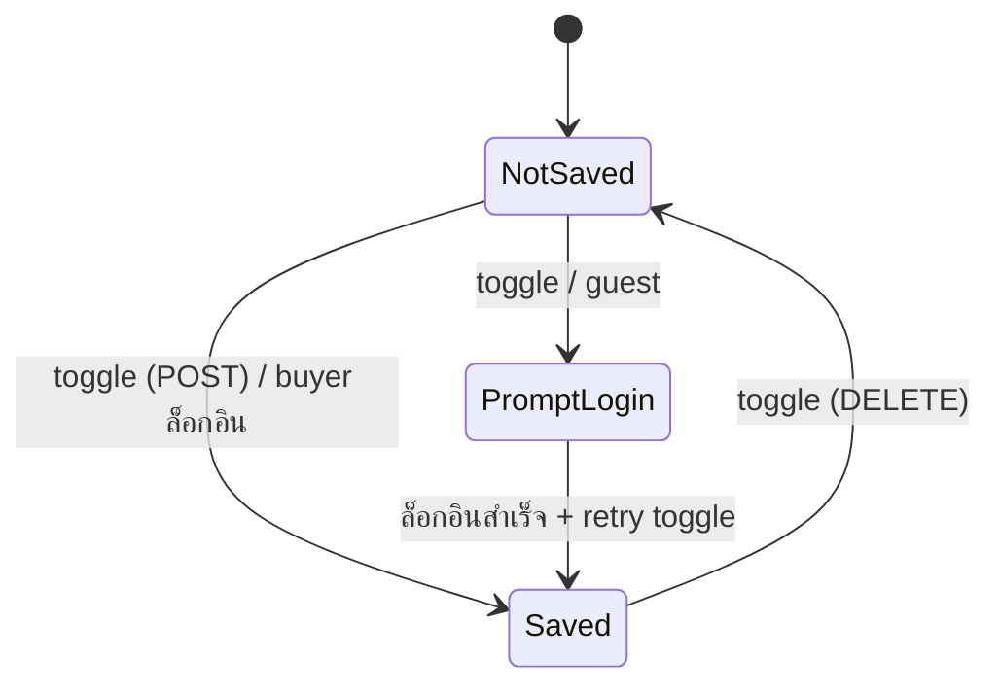

# Epic 1: Buyer Wishlist (บันทึกสินค้าที่สนใจ)

**Author/Owner**: Business Systems Analyst (BSA)
**Module**: buyer-wishlist
**Date**: 2026-06-20
**Status**: ⚪ Draft
**Phase**: A — Greenfield (no prototype yet)
**Epic Type**: mixed (product hub + transactional save action)

**PRD Reference:** [`../prd.md`](../prd.md)
**BRD Reference:** [`../brd.md`](../brd.md)
**Maps to:** FR-001, FR-002, FR-003

**Source provenance:**

- `source_legacy_path`: `(greenfield — no legacy doc)`
- `source_central_refs`: `docs/architecture/registries/buyer-components.md`
- `epic_type`: `ui-driven`

> **💡 Cross-module relocation convention** — ถ้า content ย้ายออกไป module อื่น ให้ทิ้ง `>` blockquote stub ชี้ไปบ้านใหม่ เพื่อรักษา git-blame traceability

---

### 1. Epic Information

| Field                      | Value                                                                                                  |
| -------------------------- | ------------------------------------------------------------------------------------------------------ |
| **Epic ID**                | EPIC-01                                                                                                 |
| **Epic Name**              | Buyer Wishlist                                                                                          |
| **Epic Description**       | ให้ buyer ที่ล็อกอินบันทึกสินค้าที่สนใจไว้ดู/สั่งภายหลัง — toggle จากการ์ดสินค้า + หน้า Wishlist รวม; idempotent ต่อ (buyerId, productId) |
| **Business Objective**     | เพิ่ม re-engagement: wishlist→cart conversion ≥ 8%; toggle P95 < 400ms                                  |
| **Epic Owner**             | BSA (Tech Lead: TBD)                                                                                    |
| **Epic Status**            | ⚪ Draft                                                                                                |
| **Priority**               | P1                                                                                                      |
| **Estimated Story Points** | 13                                                                                                      |

#### Release Plan

| Field | Value |
| ----- | ----- |
| **Target Release** | Phase 1.0 (R1) / 2026-Q3 |
| **Release Date** | TBD by PO |
| **Release Scope** | In R1: US-01, US-02. Phase 1.1: US-03 (ย้าย wishlist → cart) |
| **Dependencies (upstream)** | Buyer auth (Allkons ID), product catalog (`api-product`) |
| **Dependencies (downstream)** | Cart module (consume "ย้ายไปตะกร้า") |

#### Epic User Story

As a **buyer ที่ล็อกอิน**, I want **บันทึกสินค้าที่สนใจไว้ที่เดียว**, so that **กลับมาดู/สั่งภายหลังได้โดยไม่ต้องค้นใหม่**.

#### Epic User Stories Overview

| US ID | Title | Priority | Story Points | Release | Status | Notes |
| ----- | ----- | -------- | ------------ | ------- | ------ | ----- |
| US-01 | บันทึก/เอาออกสินค้าจาก Wishlist (toggle หัวใจ) | P0 | 5 | R1 | ⚪ Draft | guest → ชวนล็อกอิน |
| US-02 | ดูหน้า Wishlist ของฉัน | P1 | 5 | R1 | ⚪ Draft | empty state + pagination |
| US-03 | ย้ายสินค้าจาก Wishlist ไปตะกร้า | P2 | 3 | R2 | ⏸️ Deferred | depends on Cart module |

**Status legend**: ⚪ Draft / 🟡 In Review / 🟢 Final / 🔵 In Dev / ✅ Done / 🔴 Blocked / ⏸️ Deferred

**Total story points (this epic)**: 13 — ตรงกับ Estimated Story Points

#### Epic Scope

**In Scope:**

- Toggle บันทึก/เอาออก สินค้า ผ่านปุ่มหัวใจบนการ์ดสินค้า + หน้ารายละเอียดสินค้า
- หน้า "Wishlist ของฉัน" รวมสินค้าที่บันทึก (pagination, empty state)
- BFF endpoint `/api/buyer/v1/wishlist` (GET/POST/DELETE) idempotent ต่อ (buyerId, productId)

**Out of Scope:**

- หลาย collection / โฟลเดอร์ wishlist (deferred)
- แชร์ wishlist / แจ้งเตือนราคา-สต็อก (epic อื่น)
- ย้ายไปตะกร้า → US-03 (Phase 1.1, depends on Cart module)

#### Related Epics

- **Cart** (downstream) — consume action "ย้ายไปตะกร้า"
- **Product Catalog** (upstream) — แหล่งข้อมูลสินค้า

#### Epic Success Criteria

- buyer toggle wishlist สำเร็จ + สถานะคงอยู่หลัง refresh/ข้ามอุปกรณ์ (server-persisted)
- หน้า Wishlist แสดงครบ + empty state ชัดเจน
- wishlist→cart conversion ≥ 8% (วัดหลัง US-03)

#### Non-Functional Requirements (NFR)

| NFR | Target |
| --- | ------ |
| Performance | toggle P95 < 400ms; หน้า Wishlist LCP < 2.5s |
| Security | ผูก wishlist กับ session buyer เท่านั้น (ownership enforced server-side) |
| Privacy (PDPA) | ไม่เก็บ PII เพิ่ม; wishlist = ข้อมูลพฤติกรรม ผูก buyerId |
| Accessibility | ปุ่มหัวใจมี `aria-label` + focus state (WCAG 2.1 AA) |
| i18n | TH/EN ครบทุก copy |

#### State Machine

---

### 2. User Stories

> แต่ละ US: AC (`Given | When | Functional | Non-functional`) → BR → Validation → Edge Cases

#### US-01: บันทึก/เอาออกสินค้าจาก Wishlist ด้วยปุ่มหัวใจ

**As a** buyer ที่ล็อกอิน, **I want to** กดหัวใจบนการ์ดสินค้าเพื่อบันทึก/เอาออก, **so that** เก็บสินค้าที่สนใจได้ทันทีระหว่างเลือกดู.

US นี้เป็นเจ้าของ "การ toggle 1 สินค้า" เท่านั้น — ไม่รวมการแสดงหน้า Wishlist (US-02) และการย้ายไปตะกร้า (US-03)

**Preconditions:**

- buyer มีบัญชี Allkons และอยู่บนหน้า catalog / รายละเอียดสินค้า
- สินค้ามีสถานะ active ใน `api-product`

**Business Rules:**

| Rule ID | Rule Description | Priority |
| ------- | ---------------- | -------- |
| BR-001 | 1 buyer บันทึกสินค้าซ้ำไม่ได้ — idempotent ต่อ (buyerId, productId); re-POST คืน 200 `alreadySaved` | P0 |
| BR-002 | guest (ไม่ล็อกอิน) กดหัวใจ → เปิด login prompt; ไม่บันทึกฝั่ง client | P0 |
| BR-003 | toggle ล้มเหลว (network/server) → rollback optimistic UI กลับสถานะเดิม | P1 |

**Validation Rules:**

| Field | Validation Rule | Error Message |
| ----- | --------------- | ------------- |
| productId | ต้องมีอยู่จริง + active ใน catalog | "ไม่พบสินค้านี้แล้ว" |

**Acceptance Criteria:**

| # | Given | When | Functional | Non-functional |
|---|---|---|---|---|
| AC-01.1 | buyer ล็อกอินแล้ว อยู่บนการ์ดสินค้าที่ยังไม่บันทึก | กดปุ่มหัวใจ | • ไอคอนเปลี่ยนเป็นหัวใจทึบทันที (optimistic) • ขึ้น toast "บันทึกใน Wishlist แล้ว" • ตัวนับ Wishlist ที่ navbar +1 | บันทึกสินค้าเข้า Wishlist ของ buyer (server-persisted); recorded in the audit trail. |
| AC-01.2 | buyer ล็อกอินแล้ว สินค้าถูกบันทึกอยู่ | กดปุ่มหัวใจซ้ำ | • ไอคอนเปลี่ยนเป็นหัวใจโปร่ง • ขึ้น toast "เอาออกจาก Wishlist แล้ว" • ตัวนับ navbar −1 | เอาสินค้าออกจาก Wishlist ของ buyer; recorded in the audit trail. |
| AC-01.3 | guest ยังไม่ล็อกอิน | กดปุ่มหัวใจ | • เปิด modal เข้าสู่ระบบ หัวข้อ "เข้าสู่ระบบเพื่อบันทึกสินค้า" • ปุ่ม "เข้าสู่ระบบ" / "สมัครสมาชิก" • เมื่อล็อกอินสำเร็จ → toggle เดิมทำงานต่ออัตโนมัติ | Read-only — nothing is saved จนกว่าจะล็อกอินสำเร็จ. |
| AC-01.4 | buyer ล็อกอินแล้ว แต่เครือข่ายล้มเหลวระหว่าง toggle | กดปุ่มหัวใจ | • ไอคอน rollback กลับสถานะเดิม • ขึ้น toast error "บันทึกไม่สำเร็จ ลองใหม่อีกครั้ง" | Read-only — nothing is saved (rollback). |

**Edge Cases:** สินค้าถูกถอด active ระหว่างที่อยู่ในหน้า → toggle คืน error "ไม่พบสินค้านี้แล้ว" และซ่อนปุ่ม

#### US-02: ดูหน้า Wishlist ของฉัน

**As a** buyer ที่ล็อกอิน, **I want to** เปิดหน้า "Wishlist ของฉัน", **so that** เห็นสินค้าที่บันทึกไว้ทั้งหมดในที่เดียว.

US นี้เป็นเจ้าของการ "แสดงรายการ" เท่านั้น — การ toggle อยู่ที่ US-01

**Acceptance Criteria:**

| # | Given | When | Functional | Non-functional |
|---|---|---|---|---|
| AC-02.1 | buyer ล็อกอิน มีสินค้าบันทึก 12 รายการ | เปิด `/buyer/wishlist` | • แสดงหัวข้อ "Wishlist ของฉัน" • ตัวนับ "ทั้งหมด 12 รายการ" • การ์ดสินค้าพร้อมปุ่มหัวใจ (ทึบ) • pagination 10 ต่อหน้า | Read-only — nothing is saved. |
| AC-02.2 | buyer ล็อกอิน ยังไม่มีสินค้าบันทึก | เปิด `/buyer/wishlist` | • แสดง empty state ภาพ + ข้อความ "ยังไม่มีสินค้าใน Wishlist" • ปุ่ม "เลือกดูสินค้า" → ไป catalog | Read-only — nothing is saved. |

---

### 3. Description

ฟีเจอร์ให้ buyer บันทึกสินค้าที่สนใจ ลดแรงเสียดทานในการกลับมาซื้อ เพิ่ม conversion เป็น engagement feature ฝั่ง buyer ของ allkons-marketplace

#### Stakeholder Map

| Stakeholder | Interest |
| ----------- | -------- |
| Buyer | บันทึก/กลับมาดูสินค้าได้ง่าย |
| Seller | สินค้าถูกบันทึก = สัญญาณความสนใจ |
| Product/PO | metric conversion |

---

### 4. Prerequisites

- Buyer auth (Allkons ID) พร้อมใช้
- `api-product` มี endpoint สินค้า active

### 5. Terminology

| Term | ความหมาย |
| ---- | -------- |
| Wishlist | รายการสินค้าที่ buyer บันทึก (1 รายการต่อ buyer ใน Phase 1) |
| Toggle | การกดหัวใจเพื่อบันทึก/เอาออก |

### 6. Role and Permission Matrix

| Role | บันทึก/เอาออก | ดู Wishlist ตนเอง | ดูของผู้อื่น |
| ---- | :----------: | :--------------: | :----------: |
| Buyer (ล็อกอิน) | ✅ | ✅ | ❌ |
| Guest | ❌ (prompt login) | ❌ | ❌ |

### 7. Information in [Wishlist surface]

#### 7.1 Wishlist list — `Wishlist ของฉัน` (read-only)

แสดง: รูปสินค้า, ชื่อ, ราคา, สถานะสต็อก, ปุ่มหัวใจ (เอาออก), ปุ่ม "ดูสินค้า"

---

### 8. Requirements

#### 8.1 Functional

- FR-001 toggle บันทึก/เอาออก (idempotent)
- FR-002 แสดงหน้า Wishlist + pagination + empty state
- FR-003 (R2) ย้ายไปตะกร้า

#### 8.2 Data

- entity `Wishlist` (buyer-scoped) + `WishlistItem` (productId)

#### 8.3 Integration

- `api-product` (สถานะ/ราคา/รูป), Cart module (R2)

#### 8.4 UX

- ปุ่มหัวใจ optimistic + toast; empty state; login prompt สำหรับ guest; ยึด `buyer-components` registry + DS tokens

#### 8.5 Performance

- toggle P95 < 400ms; รายการ Wishlist query รวมข้อมูลสินค้าใน call เดียว (กัน N+1)

---

### 9. Acceptance Criteria

#### 9.1 Happy Path
- toggle on/off สำเร็จ คงสถานะข้ามอุปกรณ์; หน้า Wishlist แสดงครบ

#### 9.2 Validation
- productId ไม่ active → "ไม่พบสินค้านี้แล้ว"

#### 9.3 Errors (View Mode)
- โหลด Wishlist ล้มเหลว → error state + ปุ่มลองใหม่

#### 9.4 Errors (Action Mode)
- toggle ล้มเหลว → rollback + toast error (AC-01.4)

#### 9.5 Race Conditions
- กด toggle รัว → debounce; ผลสุดท้ายตรงกับสถานะล่าสุด (idempotent BR-001)

#### 9.6 Loading States
- skeleton การ์ดระหว่างโหลดหน้า Wishlist

#### 9.7 Per-Scenario Coverage Matrix

| Scenario | US | AC | สถานะ |
| -------- | -- | -- | ----- |
| Save | US-01 | AC-01.1 | ⚪ |
| Unsave | US-01 | AC-01.2 | ⚪ |
| Guest prompt | US-01 | AC-01.3 | ⚪ |
| Network fail | US-01 | AC-01.4 | ⚪ |
| List | US-02 | AC-02.1 | ⚪ |
| Empty | US-02 | AC-02.2 | ⚪ |

---

### 10. Risk Assessment

| Risk | Likelihood | Impact | Mitigation |
| ---- | ---------- | ------ | ---------- |
| toggle รัวทำ data ไม่ตรง | Med | Med | idempotent key + debounce |
| สินค้าถูกถอดหลังบันทึก | Med | Low | แสดง badge "ไม่พร้อมขาย" ในหน้า Wishlist |

#### Risk Summary
ความเสี่ยงรวมต่ำ — เป็น feature เสริม ไม่กระทบ flow ซื้อหลัก

---

### 11. Data Dictionary

#### Entity: Wishlist

| Field | Type | Note |
| ----- | ---- | ---- |
| id | uuid PK | |
| buyerId | uuid FK → Buyer | unique (1 wishlist/buyer Phase 1) |
| createdAt | datetime | |

#### Entity: WishlistItem

| Field | Type | Note |
| ----- | ---- | ---- |
| id | uuid PK | |
| wishlistId | uuid FK → Wishlist | |
| productId | uuid FK → Product | |
| createdAt | datetime | |

#### Relationships
- Wishlist 1—N WishlistItem; `@@unique(wishlistId, productId)` (idempotency BR-001)

---

### 12. Audit Trail Requirements

| Event (plain language) | When |
| ---------------------- | ---- |
| "สินค้าถูกบันทึกเข้า Wishlist" | AC-01.1 |
| "สินค้าถูกเอาออกจาก Wishlist" | AC-01.2 |

> event-code + payload จริง นิยามใน `02-technical-spec.md` §8.1

---

### 13. Notes
- Phase 1 = wishlist เดียวต่อ buyer; โครง data เผื่อ multi-collection อนาคต (Wishlist แยกจาก Item แล้ว)

---

### 14. Draft Technical Design

#### 14.1 API Endpoints
- `GET /api/buyer/v1/wishlist` → รายการ + ข้อมูลสินค้า (join)
- `POST /api/buyer/v1/wishlist` `{productId}` → idempotent (200 alreadySaved | 201 created)
- `DELETE /api/buyer/v1/wishlist/{productId}`

#### 14.2 Database Schema
- ตาม §11 (Wishlist, WishlistItem); migration reversible

#### 14.3 State Management
- ตาม State Machine §1; optimistic update + rollback ฝั่ง client

#### 14.5 Phase 1 mock gaps (production must add)
- server-side ownership check (buyerId = session) — บังคับใน tech-spec

#### 14.6 UI/UX Considerations
- ปุ่มหัวใจใช้ component จาก `buyer-components` registry; ห้าม hardcode สี/ระยะ ใช้ DS tokens

---

### 15. Testing Checklist

#### Pre-Testing
- fixture buyer + สินค้า active/ inactive

#### Functional Testing
- save/unsave/idempotent/guest-prompt/network-fail/list/empty

#### Security Testing
- ownership: buyer A เรียก wishlist buyer B → 403

#### Performance Testing
- toggle P95 < 400ms; list ไม่มี N+1

#### Mobile Testing
- ปุ่มหัวใจ tap target ≥ 44px; empty state responsive

---

### 16. Approval

| Role | Name | Status | Date |
| ---- | ---- | ------ | ---- |
| BSA | — | ⚪ Draft | — |
| Tech Lead | — | ⚪ | — |
| UX | — | ⚪ | — |
| PO | — | ⚪ | — |

---

### 17. Alignment (prototype = source of truth)
- ยังไม่มี prototype (Phase A) — เมื่อมี mock แล้ว ต้องรัน `/validate-ux-consistency` + sync copy เข้า glossary

---

## Change Log

| Version | Date | Changes | Author | Status |
|---------|------|---------|--------|--------|
| v1.0 | 2026-06-20 | Initial draft — §1–§17 (ตัวอย่างตาม template-module) | BSA (AI) | ⚪ Draft |
